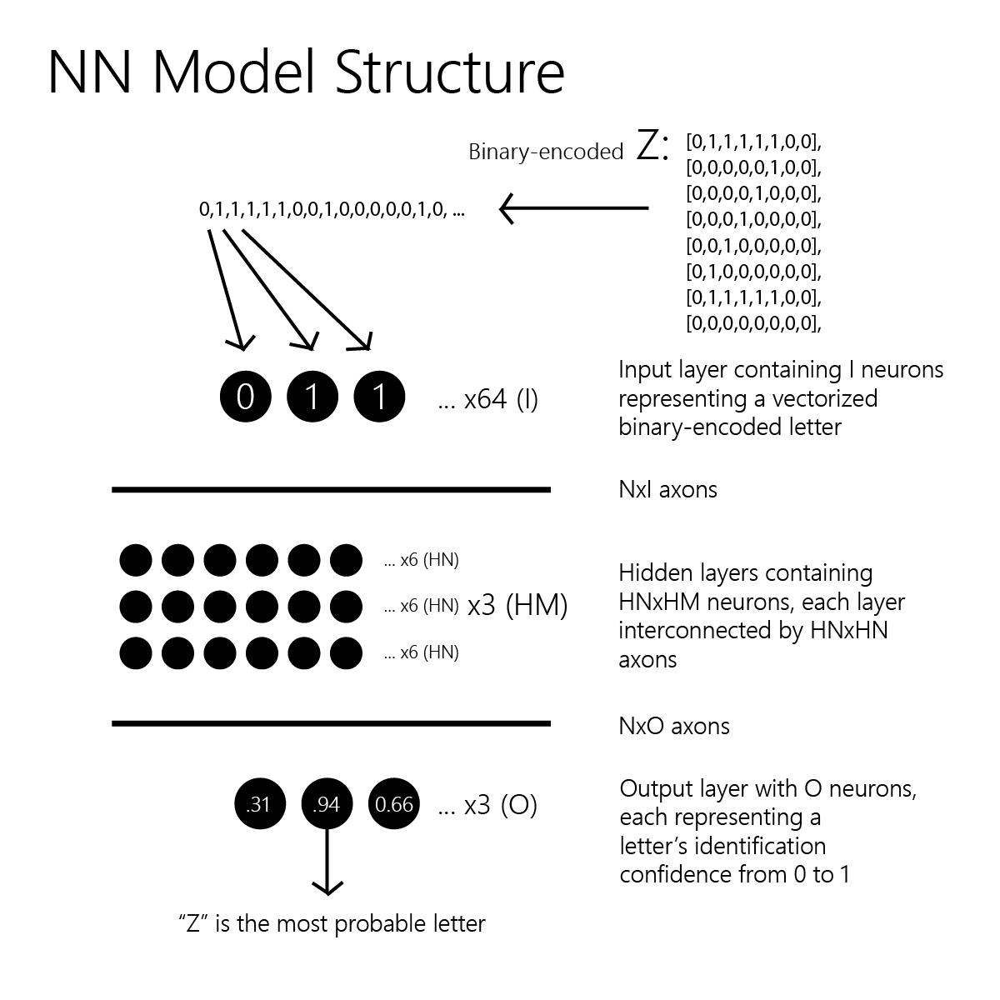

# Overview
## Articulating Goals
* We will create a highly modularized neural network framework capable of interchangeably swapping in various learning algorithms, activation functions, and structural configurations of the network.
* We will **NOT** use external neural network libraries like TensorFlow that might abstract away any processes, and we will instead minimally rely on libraries when it comes to the network's functionality.
* We would also like to visualize the network's testing process after it finishes training.
* We will compare each algorithm's accuracy at identifying letters after training.

## Technologies Used
- **Python 3.11** – Primary programming language for neural network simulation and visualization
  - **numpy** – Matrix operations, vector math, and numerical utilities
  - **pyqtgraph** – Real-time GPU-accelerated visualization of neurons and activation flows
  - **PyQt5** – GUI framework for interactive training visualization and event control
  - **collections** – Used for accuracy tracking and performance aggregation by class
- **Git + GitHub** – Source control and remote project visibility
- **VSCode** – Primary development environment for all modules, debugging, and visualization
- **Paint.NET** – Used to create 64-bit .png files of letters which were procedurally converted to our dataset's letter matrices
- **Latex + TeX Live** – Used to articulate mathematical equations used in the model
- **Adobe Illuistrator** – Used to create graphics


# Notebook A) Prerequisite Steps
## Step A1: Draft our Model
> We will train on three 8x8 binary encoded letters: A, C, and Z, with 28 training instances per letter type, simulating sparse-data high-dimension learning.

> Our network will have 64 neurons in its input layer.

> Our network will have 3 neurons in its output layer (each neuron representing the probability of the input vector being one of the three letters).

> This will be a standard neural network model (i.e., each neuron in layer A will connect to each neuron in layer B).



## Step A2: Create a Dataset
Let's use Paint.NET to create an 8x8 letter and save it as `letter_image.png`:


Next, let's write a script called [gen_data.py](data/gen_data.py) to decode this image, encode it as a binary Python matrix, and copy it to our clipboard:

```
# import libraries
from PIL import Image
import numpy as np
import pyperclip

# functions
def png_to_mat(path, threshold):
    img = Image.open(path).convert("L")
    img_array = np.array(img)
    binary_matrix = (img_array < threshold).astype(int)

    lines = []
    for row in binary_matrix:
        bitstring = ','.join(str(int(x)) for x in row)
        lines.append(f"        [{bitstring}],")
    result = "\n".join(lines)

    pyperclip.copy(result)
    print("Copied to clipboard")

# procedure
png_to_mat("letterImage.png", threshold=100)
```

After running this script, we paste the resulting matrix into our [letter_data.py](data/letter_data.py) script, where we can see 1s resembling the shape of the letter A:


We can do this until we have 30 hand-drawn letters per category saved in [letter_data.py](data/letter_data.py), with each letter matrix stored in one centralized list—the only list to be referenced by the rest of the model:

```
letterVariants = {
    "A": A_matrices,
    "C": C_matrices,
    "Z": Z_matrices,
}
```

## Step A3: Set up a Debugging Framework
Since this section isn't too relevant to the model, we will skip the details. Basically, we are creating a script [debug.py](debug.py), which will allow us to log events with varying levels of detail, color-coded tags, and optional caller metadata—useful for debugging, monitoring, and tracing execution flow during training and testing.  We'll set up the following debugging functions to be used later (indent_level being used for easier print tracking within loops):

```
def warning(self, msg: str): self._log(msg, "WARNING", "yellow")
def error(self, msg: str): self._log(msg, "ERROR", "red")

def procedure(self, msg: str): self._log(msg, "PROCEDURE", "white")
def epoch(self, msg: str): self._log(msg, "EPOCH", "cyan")
def training(self, msg: str): self._log(msg, "TRAINING", "magenta")
def testing(self, msg: str): self._log(msg, "TESTING", "white")
def analysis(self, msg: str): self._log(msg, "ANALYSIS", "cyan")

def fwd_prop(self, msg: str): self._log(msg, "FWDPROP", "lightmagenta_ex")
def back_prop(self, msg: str): self._log(msg, "BACKPROP", "lightblue_ex")

def axons(self, msg: str): self._log(msg, "AXONS", "lightblack_ex")
```

## Step A4: Set up a PyQt5-Based Visualization Framework
Again, since this section isn't too relevant to the model, we will skip the details.  In short, we will set up a framework in a new script, [render.py](render.py), that visualizes our neural network model after each trial in the testing phase.  The functions we'll use in [model.py](model.py) to control what is displayed on the screen include `update_activations()`, which updates neuron membrane potential states; `wait_for_click`, which pauses the program until a button is pressed at the bottom of the screen; and `exec_app()`, which ensures the window stays on our screen without closing once the program finishes.

## Step A5: Set up Math Functions
Since this section also isn't too relevant to the model, we will skip the details.  [math_funcs.py](functions/math_funcs.py) essentially sets up some matrix and math helper functions to reduce boilerplate.

# Notebook B) Programming the Model Skeleton

## Step B1: Set up Parameters
Let's first initialize which parameters we want to be able to tune in our [parameters script](data/params_test.py):

```
# epochs
num_epochs = 100

# training/testing data
train_test_split_ratio = 0.93

# NN learning params
μ = 0.01
num_hidden_layers = 2
num_neurons_per_hidden_layer = 64

# NN algorithms
learning_algorithm = learning_funcs.widrow_hoff_learning
learning_algorithm_deep = learning_funcs.widrow_hoff_learning_deep
activation_function = activation_funcs.activation_function_linear

# NN noise
axon_pot_interference = 0
noise_function = noise_funcs.normal_noise

# NN axon conductances
init_axon_mean = 0
init_axon_sd = 0.6

axon_weight_max_dev = 10

# misc
max_print_repeats = 99999
enable_visuals = False
```

## Step B2: Set up Neuron Layer Shapes
In [model.py](model.py), let's establish how many neurons there will per layer (in accordance with our `NN Model Structure` graph's naming practices):

```
I = len(math_funcs.matrix_to_vector(list(letter_data.letter_variants.values())[0][0]))
HN = params.num_neurons_per_hidden_layer
HM = params.num_hidden_layers
O = len(letter_data.letter_variants)

layer_sizes = [I] + [HN] * HM + [O]
if params.enable_visuals:
    render.initialize_network_canvas(layer_sizes)
```

## Step B2: Set up Epoch Loop
Let's next set up our epoch for loop, which will run `num_epochs` times:

```
epoch_letter_accuracies = []
for epoch in range(params.num_epochs):
    ...
```

### Step B21: Initialize Axon Weights Each Epoch

```
    debug.log.epoch(f"Epoch {epoch + 1} / {params.num_epochs}")

    debug.log.epoch("Splitting and randomizing order of data for training and testing...")
    training_data, testing_data = math_funcs.per_class_shuffle_split(
        letter_data.letter_variants, params.train_test_split_ratio)

    flattened_training = [
        (label, matrix)
        for label, matrices in training_data.items()
        for matrix in matrices
    ]
    np.random.shuffle(flattened_training)

    debug.log.axons("Initializing axon conductances...")
    W_matrix = axon_funcs.get_axons(I, HN, HM, O)
```

### Step B22: Training Phase

```
    for i, (actual_letter, training_matrix) in enumerate(flattened_training):

        X = math_funcs.matrix_to_vector(training_matrix)

        T = math_funcs.one_hot(actual_letter, O)

        W_matrix = params.learning_algorithm_deep(X, W_matrix, t=T)
```

### Step B23: Testing Phase

```
    letter_accuracies = {}

    for actual_letter, testing_matrices in testing_data.items():
        for i, matrix in enumerate(testing_matrices):
            X = math_funcs.matrix_to_vector(matrix)
            layer_outputs = fwd_prop_funcs.fwd_prop_deep(X, W_matrix, return_all_layers=True)
            y = layer_outputs[-1]
            predicted_index = np.argmax(y)
            predicted_letter = list(letter_data.letter_variants.keys())[predicted_index]

            is_correct = (predicted_letter == actual_letter)

            debug.log.testing(f"Predicted: '{predicted_letter}'; Actual: '{actual_letter}'")

            if actual_letter not in letter_accuracies:
                letter_accuracies[actual_letter] = []
            letter_accuracies[actual_letter].append(is_correct)

            if params.enable_visuals:
                render.update_activations(
                    layer_outputs,
                    actual_letter=actual_letter,
                    predicted_letter=predicted_letter,
                    output_vector=y
                )
                render.wait_for_click()
```

## Step B3: Analysis
We will truncate this section, since the specifics are not important. But in short, this section computes the model’s average accuracy across all epochs and letters, compares it to a baseline random guess accuracy, and outputs a detailed breakdown of accuracy deltas for each individual letter.

# Notebook C) Implementing General Functions
## Step C1: [Axon Initialization](functions/axon_funcs.py)
Let's assume our axon conductances (weights) are initialized along a normal distribution:
```
def init_axon_val():
    return random.normalvariate(
        mu=params.init_axon_mean,
        sigma=params.init_axon_sd)
```

Next, let's set up our broader initialization function for creating an axon conductance matrix such that it forms axons between the input layer and the output layer; or, if hidden layers exist, axons between the input layer and the first hidden layer, between each hidden layer, and between the final hidden layer and the output layer:
```
def get_axons(I, HN, HM, O):
    def new_layer(n_out, n_in):
        return [[init_axon_val() for _ in range(n_in)] for _ in range(n_out)]
    
    # Exception for perceptrons
    if HM == 0:
        return new_layer(I, O)

    # Input -> First hidden layer
    axons_input_hidden = new_layer(HN, I)  # HN x I

    # Hidden -> Hidden (HM - 1 layers of axons)
    axons_hidden_hidden = [new_layer(HN, HN) for _ in range(HM - 1)]  # HM-1 layers of HN x HN

    # Last hidden -> Output
    axons_hidden_output = new_layer(O, HN)  # O x HN

    return [axons_input_hidden] + axons_hidden_hidden + [axons_hidden_output]
```

Next, let's implement a function to prevent, during training, weights from being updated to have unrealistically high or low conductances:
```
def clip_weights(W_new):
    return np.clip(W_new, -params.axon_weight_max_dev, params.axon_weight_max_dev)
```

Finally, let's implement a function to normalize membrane potential values before passing them into our learning algorithms in order to prevent explosion.  This function will be based on Euclidean normalization:
```
def euc_normalize_membrane_pots(X):
    return X / (np.sqrt(np.sum(np.abs(X) ** 2)) + 1e-8)
```

## Step C2: [Forward Propagation](functions/fwd_prop_funcs.py)
This section is essential, since it implements the functionality for propagating action potentials through the model, used to calculate postsynaptic membrane potentials.  This is used in both A) using a model which has already been trained on testing data and B) calculating the next neuron in a layer's membrane potential so that a supervised learning algorithm can calculate error between the goal (target) signal and the actual signal produced by the current model.

The following represents how forward propagation is computed for one postsynaptic neuron:


Let's implement this logic in code:

```
def fwd_prop(X, W_matrix):

    b = params.noise_function(params.axon_pot_interference)
    S = np.dot(X, W_matrix) + b
    Y = params.activation_function(S)
    
    return Y
```

The above function performs forward propagation from a vector of presynaptic membrane potentials and a list of weight vectors between a postsynaptic neuron and each presynaptic neuron.

If we would like to generalize this script to work with multi-layer neural networks (i.e., NNs with hidden layers, implying fwd_prop needs to be iterated over for each group of weights between two neuron layers), then let's implement the following function:

```
def fwd_prop_deep(X, W_layers, return_all_layers=False):

    X_working = X
    outputs = [X_working]
    for W_matrix in W_layers:
        Y = fwd_prop(X, W_matrix)
        X_working = Y
        outputs.append(Y)

    return outputs if return_all_layers else outputs[-1]
```

The above function is suitable for general use in our [model.py](model.py) script since it abstracts away the complexities of propagating an input signal throughout the entire network.

## Step C3: [Forward Propagation Noise](functions/noise_funcs.py)

In our forward propagation script, we alllude to b, which generates noise based on a forward propagation noise function.  Let's briefly introduce a noise function to fulfill this purpose, which is simply a normal distribution with a standard deviation defined in our parameters script:

```
def normal_noise(sd):
    return random.normalvariate(mu=0, sigma=sd)
```

## Step C4: [Activation Functions](functions/activation_funcs.py)

This section implements the activation functions used to compute a neuron's output given its membrane potential. Activation functions introduce nonlinearity into the neural model, which is essential for enabling the network to approximate complex patterns.

Each activation function below supports a `derivative` flag, which is used during supervised learning to compute gradients, and a `from_output` flag, which optimizes the derivative computation when the output value has already been cached.


---

### Linear Activation

The linear activation function simply returns the input membrane potential. It does not introduce any nonlinearity and is primarily used for output neurons in regression models.

```
def activation_function_linear(x, derivative=False, from_output=False):
    x = np.array(x)
    if derivative:
        return np.ones_like(x)
    return x
```

- `output`:             `x`
- `derivative`:         `1`

---

### Threshold Activation

The threshold function returns `1.0` if the input is greater than or equal to 0.5, and `0.0` otherwise. It is a simple binary decision function, typically used in very early neural models or discrete output tasks.

```
def activation_function_threshold(x, derivative=False, from_output=False):
    x = np.array(x)
    if derivative:
        return np.zeros_like(x)
    return (x >= 0.5).astype(float)
```

- `output`:             `1.0` if `x >= 0.5`, else `0.0`
- `derivative`:         `0` (undefined in practice)

---

### Sigmoid Activation

The sigmoid function maps input values to a smooth curve between 0 and 1. This is useful for probabilistic interpretations and commonly used in binary classification output layers.

```
def activation_function_sigmoid(x, derivative=False, from_output=False):
    x = np.array(x)
    s = 1 / (1 + np.exp(-x))
    if derivative:
        return s * (1 - s) if not from_output else x * (1 - x)
    return s
```

- `output`:             `1 / (1 + exp(-x))`
- `derivative`:         `s * (1 - s)` or `x * (1 - x)` if `from_output=True`

# Notebook D) Implementing and Analyzing Learning Functions

## Step D1: Unsupervised Hebbian Learning


Let's implement this rule programatically.  And when we do so, we will include a shallow (`unsup_hebbian_learning`) and a deep (`unsup_hebbian_learning_deep`) version in order to ensure we can perform multi-layer Hebbian learning with ease from other scripts in our framework:

```
def unsup_hebbian_learning(X, W, Y=None, T=None):

    X = np.array(X)
    Y = np.array(Y)

    ΔW = params.μ * np.outer(Y, X)

    W_new = W + ΔW

    return axon_funcs.clip_weights(W_new)

def unsup_hebbian_learning_deep(X, W_matrix, Y=None, T=None):

    X_working = np.array(X.copy())
    W_matrix_new = []

    debug.log.indent_level += 1
    for i, W in enumerate(W_matrix):
        Y_layer = np.array([fwd_prop_funcs.fwd_prop_single(X_working, w_row) for w_row in W])
        W_new = unsup_hebbian_learning(X_working, W, Y=Y_layer)
        W_matrix_new.append(W_new)
        X_working = Y_layer
    debug.log.indent_level -= 1

    return W_matrix_new
```

## Step D2: Unsupervised Normalized Hebbian Learning

Next, let's implement a version with the algorithm's membrane potentials normalized using Euclidean normalization in order to more smoothly prevent weight explosion than purely by using our `clip_weights` function.

```
def unsup_norm_hebbian_learning(X, W, Y=None, T=None):

    X = np.array(X)
    Y = np.array(Y)

    X_norm = axon_funcs.euc_normalize_membrane_pots(X)
    Y_norm = axon_funcs.euc_normalize_membrane_pots(Y)

    ΔW = params.μ * np.outer(Y_norm, X_norm)

    W_new = W + ΔW

    return axon_funcs.clip_weights(W_new)

def unsup_norm_hebbian_learning_deep(X, W_matrix, Y=None, T=None):

    ...
```

## Step D3: Semi-Supervised Hebbian Learning


```
def semisup_hebbian_learning(X, W, Y=None, T=None):
    """
    output: W_new
    """
    X = np.array(X)
    T = np.array(T)

    ΔW = params.μ * np.outer(T, X)
    
    W_new = W + ΔW

    return axon_funcs.clip_weights(W_new)

def semisup_hebbian_learning_deep(X, W_matrix, Y=None, T=None):
    """
    output: W_matrix_new
    """
    X_working = np.array(X.copy())
    W_matrix_new = []

    debug.log.indent_level += 1
    for i, W in enumerate(W_matrix):
        if i < len(W_matrix) - 1:
            Y_layer = np.array([fwd_prop_funcs.fwd_prop_single(X_working, w_row) for w_row in W])
            W_new = unsup_hebbian_learning(X_working, W, Y=Y_layer)
            X_working = Y_layer
        else:
            W_new = semisup_hebbian_learning(X_working, W, T=T)
        W_matrix_new.append(W_new)
    debug.log.indent_level -= 1

    return W_matrix_new
```

## Step D4: Semi-Supervised Normalized Hebbian Learning

```
def semisup_norm_hebbian_learning(X, W, Y=None, T=None):
    """
    output: W_new
    """
    X = np.array(X)
    T = np.array(T)

    X_norm = X / (np.linalg.norm(X) + 1e-8)
    ΔW = params.μ * np.outer(T, X_norm)
    W_new = W + ΔW

    return axon_funcs.clip_weights(W_new)

def semisup_norm_hebbian_learning_deep(X, W_matrix, Y=None, T=None):
    
    ...
```

## Step D5: Supervised Widrow-Hoff Learning


```
def widrow_hoff_learning(X, W, Y=None, T=None):
    """
    output: W_new
    """
    X = np.array(X)
    Y = np.array(Y)
    T = np.array(T)

    dY = params.activation_function(Y, derivative=True, from_output=True)
    Delta = (T - Y) * dY
    ΔW = params.μ * np.outer(Delta, X)

    W_new = np.array(W) + ΔW

    return axon_funcs.clip_weights(W_new)

def widrow_hoff_learning_deep(X, W_matrix, Y=None, T=None):
    """
    output: W_matrix_new
    """
    if Y is None:
        Y = fwd_prop_funcs.fwd_prop_deep(X, W_matrix, return_all_layers=True)

    Activations = [np.array(X)] + [np.array(Y_i) for Y_i in Y]
    num_layers = len(W_matrix)
    Deltas = [None] * num_layers

    Y_output = np.array(Y[-1])
    T = np.array(T)
    Act_deriv_output = np.array([params.activation_function(Y_i, derivative=True, from_output=True) for Y_i in Y_output])
    Deltas[-1] = (T - Y_output) * Act_deriv_output

    for l in reversed(range(num_layers - 1)):
        W_next = np.array(W_matrix[l + 1])
        Δnext = Deltas[l + 1]
        Y_l = np.array(Y[l])
        Act_deriv = np.array([params.activation_function(Y_i, derivative=True, from_output=True) for Y_i in Y_l])
        Deltas[l] = (W_next.T @ Δnext) * Act_deriv

    W_matrix_new = []
    for i in range(num_layers):
        Input_to_layer = Activations[i]
        W = np.array(W_matrix[i])
        Error_signal = Deltas[i]
        ΔW = params.μ * np.outer(Error_signal, Input_to_layer)
        W_new = W + ΔW
        W_matrix_new.append(W_new)

    return W_matrix_new
```
